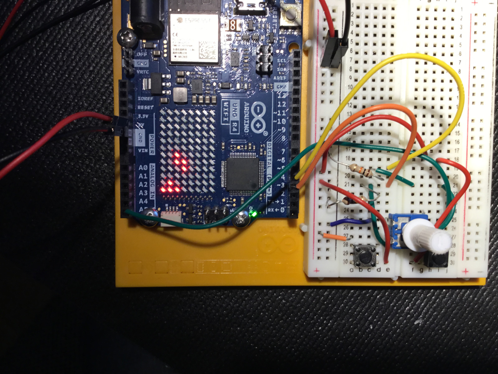

# Tetris for the Arduino UNO R4 Wifi LED Matrix

Use the LED Matrix to play games!

### To build with PlatformIO:  
1. Install VS Code Extension
2. Connect your Arduino UNO R4 with a USB-cable
3. `pio run --target upload` or use the GUI controls.

### You will need:  
- a potentiometer connected to pin A5 
- 2 buttons with external pulldown resistors (10 kOhm) connected to digital pin 3 and 4  

